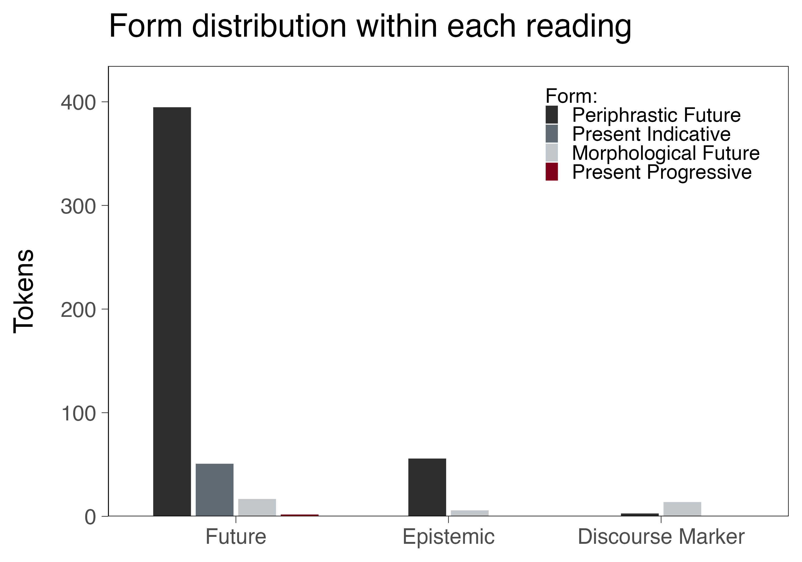

# Futurity and Probability

### The Expression of Futurity

* Prime example of diachronic and synchronic variation leading to a language change  (Orozco, 2022) 
    * Morphological Future (MF):  cantaré , 'I will sing'
    * Periphrastic Future (PF): voy a cantar , 'I am going to sing'
    * Present Indicative (PI):  canto , 'I sing'
    * Present Progressive (PP):  estoy cantando , 'I am singing'
        
* Well-documented among monolinguals  (e.g., Aaron, 2014; Orozco, 2015; Claes & Ortiz López, 2011) 

--

### From Futurity to Epistemic Modality

* Some forms traditionally associated with futurity have developed epistemic uses to express uncertainty about the present:   <i>Laura estará en casa</i>, ‘Laura  will/must be  at home’

???
Some definitions:
* Future: an event or state posterior to the moment of speech (Comrie, 1985; Reichenbach, 1947)
  
* Epistemicity: speaker's level of certainty toward the utterance (Gennari, 2000; Kearns, 2011)
  
---

### The Bilingual Puzzle 

* Key site for cross-linguistic variation, despite apparent parallels in Spanish and English

* Multiplicity of forms, lack of exact correspondence between Spanish and English, and the evolution of some structures create a unique puzzle for heritage speakers

* Certain variable structures might be harder to acquire: competing forms, probabilistic use (Nagy, 2024)

* Scarce research on U.S. bilinguals  (e.g., Durán Urrea & Gradoville, 2006; Pascual y Cabo & Vela, 2020; Torres, 2024; Zahler & Leguisamon Tolentino, 2024) 
    * Methodological limitations
    * Documentation of several trends that warrant further investigation

---
# The Current Project

### Objectives

* Explore how heritage speakers of Spanish use the Spanish MF and the PF in general, as well as the PI and the PP for future reference, in natural speech

* Test the semantic-pragmatic and social factors that constrain the variable use of the MF, PF, PI, and PP

* Analyze whether the patterns observed are a result of contact with English, internal language change, or a combination of both

--

 

### Methods

* Two complementary studies: Corpus Analysis + Experimental Task

---
###  Study 1: Corpus Analysis 

<b>Goal:</b> To examine the general uses of the MF and the PF, and, in particular, the synchronic variation of the MF, PF, PI, and PP to express futurity 

* Target Corpora:
    * *Corpus del Español en Arizona*  (Carvalho, 2012-) 
    * *Spanish in Texas Corpus* (Bullock & Toribio, 2024) 

* ~ 2,500 datapoints (112 participants)

* Tokens manually extracted and hand-coded for semantic, pragmatic, and social factors (reading, verb class, bilingual profile, etc.)

* Exclusions: repetitions, fixed expressions, etc.

* Two subsets of analysis using Bayesian statistical methods

* Status:
    * Data extraction is completed 
    * Data coding is currently in progress

???
Coding procedure: 

* Linguistic factors:
    * Reading: prospective, epistemic
    * Form: MF, PF, PI
    * Temporal distance: immediate, close, distant
    * Grammatical person (proxy of certainty)
    * Verb class: dynamic, motion, stative, psychological, perceptual
    * Adverb specification: yes, no
* Social factors:
    * Participant id
    * Type of bilingualism: sequential, simultaneous
    * Age (continuous measure)

---
###  Study 2: Experimental Task 

<b> Goal: </b> To examine the reported preference for the expression of futurity in Spanish and the sources of variation

* Participants (anticipated, N=100):
    * Min. 60 adult Spanish heritage speakers in the U.S.
    * Min. 20 adult Spanish monolinguals
    * Min. 20 adult English monolinguals

* Materials:
    * Bilingual Language Profile  (Birdsong et al., 2012) 
    * LexTALE in Spanish  (Izura et al., 2014)  and English (Lemhöfer & Broersma, 2012) 
    * Rating Task in Spanish and English
    
---
*(Study 2, cont.)*

* Rating Task 
    * Participants rate the probability of saying each target sentence
    * Items manipulated for:
        * Verb form [PF, PI, PP]
        * Temporal distance [immediate, close, distant]
        * Plan certainty [certain, uncertain]
    * Total of 36 contexts divided into 6 conditions
    * A total of 218 items - 3 lists: 108 targets, 108 distractors, 2 training
    * 74 items per participant
    * Spanish and English versions are identical
    * Sample stimulus, in Spanish (*next slide*)
    
* Procedure
    * Bilinguals complete the experiment in both Spanish and English (two weeks in between versions)
    * Monolinguals complete the task only in their L1

* Data analysis using Bayesian statistical methods

---
 

<table style="border-collapse: separate;border-spacing: 0px 5px; border: 0; background-color: white !important;">
 <thead>
  <tr>
   <th style="font-size:17.75px; text-align:left; height:21pt; background-color: white !important; width:10%;">  </th>
   <th style="font-size:17.75px; text-align:left; background-color: white !important; width:90%;"> [immediate, certain] </th>
  </tr>
 </thead>
<tbody>
  <tr>
   <td style="font-size:17.75px; text-align:left; background-color: white !important;"> <b>Context</b> </td>
   <td style="font-size:17.75px; text-align:left; background-color: white !important;"> Mateo y Laura terminaron los deberes y hablan de sus planes. </td>
  <tr>
   <td style="font-size:17.5px; text-align:left; background-color: white !important;"> </td>
   <td style="font-size:17.5px; text-align:left; background-color: white !important;"> ‘Mateo and Laura finished their homework and talk about their plans.  </td>
  </tr>
  <tr>
   <td style="font-size:17.75px; text-align:left; background-color: white !important;"> </td>
   <td style="font-size:17.75px; text-align:left; background-color: white !important;"> Mateo, que ya lo ha decidido, le dice: </td>
   </tr>
  <tr>
   <td style="font-size:17.75px; text-align:left; background-color: white !important;"> </td>
   <td style="font-size:17.75px; text-align:left; background-color: white !important;"> Mateo, who has already decided, says:’   </td>
  </tr>
  <tr>
   <td style="font-size:17.75px; text-align:left; background-color: white !important;"> <b>Sentence</b> </td>
   <td style="font-size:17.75px; text-align:left; background-color: white !important;"> 1. En 5 minutos voy a jugar al fútbol. </td>
  <tr>
   <td style="font-size:17.75px; text-align:left; background-color: white !important;"> </td>
   <td style="font-size:17.75px; text-align:left; background-color: white !important;"> 1. ‘I am going to play soccer in 5 minutes.’   </td>
  </tr>
  <tr>
   <td style="font-size:17.75px; text-align:left; background-color: white !important;"> </td>
   <td style="font-size:17.75px; text-align:left; background-color: white !important;"> 2. En 5 minutos juego al fútbol. </td>
  </tr>
  <tr>
   <td style="font-size:17.75px; text-align:left; background-color: white !important;"> </td>
   <td style="font-size:17.75px; text-align:left; background-color: white !important;"> 2. ‘I play soccer in 5 minutes.’   </td>
  </tr>
  <tr>
   <td style="font-size:17.75px; text-align:left; background-color: white !important;"> </td>
   <td style="font-size:17.75px; text-align:left; background-color: white !important;"> 3. En 5 minutos estoy jugando al fútbol. </td>
  </tr>
  <tr>
   <td style="font-size:17.75px; text-align:left; background-color: white !important;"> </td>
   <td style="font-size:17.75px; text-align:left; background-color: white !important;"> 3. ‘I am playing soccer in 5 minutes.’   </td>
  </tr>
  <tr>
   <td style="font-size:17.75px; text-align:left; background-color: white !important;"> <b>Task</b> </td>
   <td style="font-size:17.75px; text-align:left; background-color: white !important;"> ¿Cómo de probable es que tú digas esta frase? </td>
  <tr>
   <td style="font-size:17.75px; text-align:left; background-color: white !important;"> </td>
   <td style="font-size:17.75px; text-align:left; background-color: white !important;"> ‘How likely are you to say this sentence?’ </td>
  </tr>
</tbody>
</table>

---
# Initial Observations

???

**Summary**
* The PF is the preferred form to express futurity, but it is also used to express epistemic modality

* The MF is employed to mark both futurity and epistemic modality, and as a discourse marker (epistemic hedging)

* The PI seems to be mainly restricted to scheduled events (e.g., birthdays)

* The PP is barely used

---
### Example Utterances

#### Future
La mayor tiene veinticinco [años] […] XX  va a cumplir  veinte […] YY pronto  cumple  quince y ZZ tiene trece.  
‘The oldest is twenty-five […] XX  is turning  twenty […] YY  is  almost fifteen, and ZZ is thirteen.’

 

#### Epistemic
Está muy bien, pero yo más bien si lo uso,  va a ser  una o dos veces al año.  
‘It [the light rail] is great, but if I use it, it  might be  once or twice a year.’

Entonces,  será  que yo miré eso y dije…  
‘So, it  must be  that I saw that and said…’

Yo  diré  la fiesta del año nuevo.  
‘I  would say  the New Year’s party.’

---
# References

  

Aaron, J. E. (2014). A Certain Future: Epistemicity, Prediction, and Assertion in Iberian Spanish Future Expression. <i>Studies in Hispanic and Lusophone Linguistics, 7</i>(2), 215–240. <a href  https://doi.org/10.1515/shll-2014-1166> https://doi.org/10.1515/shll-2014-1166</a>

Birdsong, D., Gertken, L. M., & Amengual, M. (2012). <i>Bilingual Language Profile: An Easy-to-Use Instrument to Assess Bilingualism</i>. COERLL, University of Texas at Austin. <a href https://sites.la.utexas.edu/bilingual/>https://sites.la.utexas.edu/bilingual/ </a> 

Bullock, B. E., & Toribio, A. J. (2024). <i>Spanish in Texas Corpus</i> [Dataset]. Texas Data Repository.

Carvalho, A. M. (2012). <i>Corpus del Español en el Sur de Arizona (CESA)</i> [Dataset]. University of Arizona.

Claes, J., & Ortiz López, L. A. (2011). Restricciones Pragmáticas y Sociales en la Expresión de Futuridad en el Español de Puerto Rico. <i>Spanish in Context, 8</i>, 50–72.

Durán Urrea, E., & Gradoville, M. (2006). Variation in the Future Tense of New Mexican Spanish. <i>Texas Linguistics Forum, 50 (SALSA XIV Proceedings)</i>.

Izura, C., Cuetos, F., & Brysbaert, M. (2014). Lextale-Esp: A test to rapidly and efficiently assess the Spanish vocabulary size. <i>Psicológica, 35</i>, 49–66.

---

  

Lemhöfer, K., & Broersma, M. (2012). Introducing LexTALE: A quick and valid Lexical Test for Advanced Learners of English. <i> Behavior Research Methods, 44</i>(2), 325–343. <a href https://doi.org/10.3758/s13428-011-0146-0> https://doi.org/10.3758/s13428-011-0146-0 </a>

Nagy, N. (2024). <i> Heritage Languages: Extending Variationist Approaches </i>.

Orozco, R. (2022). The expression of futurity in Spanish: An empirical investigation. In M. Díaz-Campos (Ed.), <i>The Routledge Handbook of Variationist Approaches to Spanish</i> (pp. 315–327). Routledge.

Orozco, R. (2015). Castilian in New York City: What can we learn from the future? In S. Sessarego & M. González-Rivera (Eds.), <i>New Perspectives on Hispanic Contact Linguistics in the Americas</i> (pp. 347–372). Iberoamericana Vervuert. <a href https://doi.org/10.31819/9783954878314-017> https://doi.org/10.31819/9783954878314-017 </a>

Pascual y Cabo, D., & Vela, G. (2020). Futurity and probability in Spanish as a heritage language. In A. Morales-Front, M. J. Ferreira, R. P. Leow, & C. Sanz (Eds.), <i>Issues in Hispanic and Lusophone Linguistics</i> (Vol. 26, pp. 286–302). John Benjamins Publishing Company. <a href https://doi.org/10.1075/ihll.26.14cab> https://doi.org/10.1075/ihll.26.14cab </a>

Torres, C. (2024). La alternancia en las expresiones del futuro en el español de hablantes de origen hispano en Houston, Texas. <i>Revista de Filología y Lingüística de la Universidad de Costa Rica, 50</i>(1). <a href https://doi.org/10.15517/rfl.v50i1.57568> https://doi.org/10.15517/rfl.v50i1.57568</a>

Zahler, S. L., & Leguisamon Tolentino, R. (2024). The present progressive as a future marker in Spanish, English, and Spanish in contact with English. In M. Gradoville & S. McKinnon (Eds.), <i>Issues in Hispanic and Lusophone Linguistics </i> (Vol. 41, pp. 151–171). John Benjamins Publishing Company.

---
class: center, middle

#  Thank you! 

  

### Meritxell Feliu-Ribas
### [mfeliuribas@spanport.rutgers.edu](mailto:mfeliuribas@spanport.rutgers.edu)

